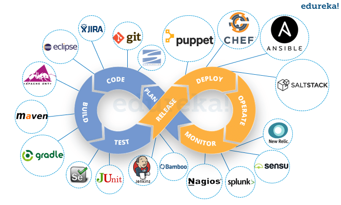
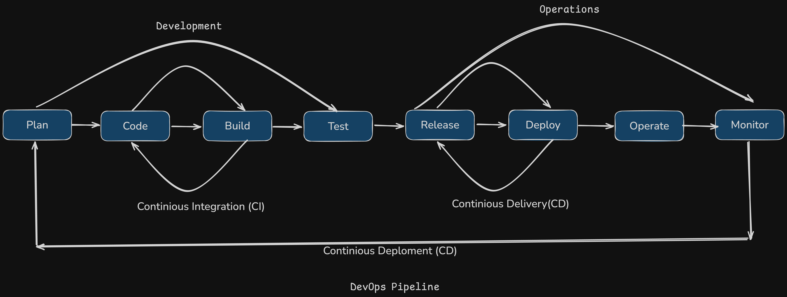

# DevOps Pipeline Design
## Understanding DevOps in the Software Development Life Cycle (SDLC)

## 1. Need/Background of DevOps and Its Requirement in SDLC

The **Software Development Life Cycle (SDLC)** encompasses all stages of software creation, from initial planning and requirements gathering to development, testing, deployment, and maintenance. Traditionally, the SDLC has been segmented into distinct phases, often managed by separate teams such as Development and Operations. This separation has historically led to several challenges:

- **Siloed Teams**: Development and Operations teams often operate independently, leading to miscommunication and misaligned objectives.
- **Delayed Deployments**: The handoff between development and operations can introduce delays, slowing down the release of features and bug fixes.
- **Inconsistent Environments**: Discrepancies between development, testing, and production environments can cause unexpected issues during deployment.
- **Lack of Continuous Feedback**: Limited feedback loops make it difficult to identify and address issues promptly, affecting the overall quality of the software.

**DevOps** emerged as a solution to these challenges by promoting a culture of collaboration, integration, and automation between Development and Operations teams. By breaking down silos and fostering continuous collaboration, DevOps aims to streamline the SDLC, enhancing efficiency, reliability, and speed in software delivery.

## 2. Explanation of Development (Dev) and Operations (Ops) Parts

### Development (Dev)

The **Development** aspect focuses on the creation of software applications. Key responsibilities include:

- **Coding and Programming**: Writing, testing, and maintaining the application's source code.
- **Version Control**: Managing changes to the codebase using tools like Git to ensure code integrity and facilitate collaboration.
- **Continuous Integration (CI)**: Frequently integrating code changes into a shared repository, followed by automated builds and tests to detect issues early.
- **Feature Development**: Implementing new features and functionalities based on user requirements and feedback.

### Operations (Ops)

The **Operations** side is concerned with deploying and maintaining the software in production environments. Key responsibilities include:

- **Infrastructure Management**: Setting up and managing servers, networks, and other infrastructure components required to run the applications.
- **Deployment Automation**: Streamlining the process of releasing software updates to various environments (development, staging, production) using tools like Jenkins, Docker, or Kubernetes.
- **Monitoring and Logging**: Continuously tracking the performance and health of applications and infrastructure to identify and resolve issues proactively.
- **Security and Compliance**: Ensuring that systems are secure and comply with relevant regulations and standards.

## 3. How DevOps Solved the Problems discussed in SLDC

DevOps addresses the challenges in the SDLC by fostering a culture of collaboration and leveraging automation to streamline processes. Here's how DevOps solves the problems outlined earlier:

- **Breaking Down Silos**: By integrating Development and Operations teams, DevOps encourages shared responsibilities and objectives, enhancing communication and collaboration. This unified approach ensures that both teams work towards common goals, reducing misunderstandings and conflicts.

- **Accelerating Deployments**: DevOps emphasizes automated deployment pipelines (Continuous Delivery/Continuous Deployment), which speed up the release process. Automation minimizes manual interventions, reducing the time taken to deploy updates and enabling faster delivery of features and fixes.

- **Ensuring Consistent Environments**: Using infrastructure as code (IaC) tools like Terraform or Ansible, DevOps ensures that development, testing, and production environments are consistent and reproducible. This consistency eliminates environment-specific issues, leading to more reliable deployments.

- **Implementing Continuous Feedback Loops**: DevOps practices incorporate continuous monitoring and feedback mechanisms, allowing teams to identify and resolve issues promptly. Tools like Prometheus, Grafana, and ELK Stack provide real-time insights into system performance and user behavior, facilitating proactive improvements.

- **Enhancing Quality and Reliability**: Automated testing integrated into the CI pipeline ensures that code changes are thoroughly tested before deployment. This leads to higher quality software with fewer defects reaching production, enhancing overall reliability.

- **Improving Scalability and Efficiency**: Automation of repetitive tasks and scalable infrastructure management enables organizations to handle increased loads without compromising performance. DevOps practices ensure that systems can scale efficiently to meet growing demands.

In summary, DevOps transforms the traditional SDLC by promoting a collaborative culture and leveraging automation to enhance efficiency, reliability, and speed in software delivery. By addressing the inherent challenges in the SDLC, DevOps enables organizations to deliver high-quality software that meets the evolving needs of stakeholders.

## 4. DevOps Pipeline Design Overview

A well-designed DevOps pipeline automates the software delivery process, ensuring rapid and reliable deployments. This overview outlines the key elements and considerations involved in crafting an effective pipeline.

#### 1. Understanding the Problem and Limitations

The primary objective of a DevOps pipeline is to streamline the software delivery lifecycle, enhancing efficiency, minimizing errors, and maintaining consistent quality. To achieve this, it's essential to recognize the challenges and edge cases that may arise during implementation:

- **Integration with Existing Systems**: Seamlessly connecting with current tools and workflows is crucial. This involves assessing compatibility issues, data migration strategies, and ensuring that new tools do not disrupt existing processes. For instance, integrating Jenkins with legacy systems may require custom plugins or APIs.

- **Scalability**: As the application and user base grow, the pipeline must handle increased load without compromising performance. This includes scaling infrastructure components like build servers and ensuring that the pipeline can accommodate more concurrent builds and deployments.

- **Security**: Protecting sensitive data throughout the pipeline is paramount. Implementing robust security measures such as encryption, access controls, and compliance with regulations (e.g., GDPR, HIPAA) helps safeguard against vulnerabilities and breaches.

- **Reliability and Fault Tolerance**: Ensuring that the pipeline remains functional even in the face of failures requires redundancy and robust error-handling mechanisms. This might involve setting up failover strategies and monitoring systems to detect and respond to issues promptly.

- **Flexibility and Customization**: The pipeline should be adaptable to various project requirements and workflows. This flexibility allows for the integration of different tools and processes tailored to specific development needs.

#### 2. Strategic Selection of Stack and Services

Choosing the right tools and technologies is critical for building a robust DevOps pipeline. The following components are commonly selected based on their functionality and compatibility:

- **Version Control**: 
  - **Git**: A distributed version control system that tracks changes in the codebase, facilitating collaboration among developers. Platforms like GitHub, GitLab, and Bitbucket offer additional features such as issue tracking and code reviews.

- **CI/CD Tools**: 
  - **Jenkins**: An open-source automation server that supports building, deploying, and automating projects. Jenkins' extensive plugin ecosystem allows for customization to fit various workflows.
  - **GitLab CI**: Integrated with GitLab repositories, it provides seamless CI/CD capabilities with features like pipelines, runners, and built-in security scanning.

- **Containerization**: 
  - **Docker**: Enables packaging applications and their dependencies into containers, ensuring consistency across different environments. Docker simplifies deployment and scaling by making applications portable and isolated.

- **Orchestration**: 
  - **Kubernetes**: Manages containerized applications at scale, handling tasks such as deployment, scaling, and management of containerized services. Kubernetes automates the distribution and scheduling of containers across clusters.

- **Cloud Services**: 
  - **AWS (Amazon Web Services)** or **Azure**: Provide scalable and reliable infrastructure for hosting applications. These platforms offer a wide range of services, including compute, storage, networking, and managed databases, facilitating rapid scaling and high availability.

- **Monitoring and Logging**: 
  - **Prometheus** and **Grafana**: Prometheus collects and stores metrics, while Grafana visualizes them through customizable dashboards. Together, they provide real-time insights into system performance and health.
  - **ELK Stack (Elasticsearch, Logstash, Kibana)**: Facilitates centralized logging, enabling the aggregation, processing, and visualization of log data for comprehensive monitoring and analysis.

#### 3. Detailed Pipeline Stages

A DevOps pipeline typically consists of several interconnected stages, each contributing to the seamless delivery of software from development to production:

1. **Plan**:
   - **Requirement Assessment and Finalization**: Collaborate with stakeholders to gather and finalize project requirements, ensuring that all necessary features and constraints are clearly defined and understood.
   - **Timeline Estimation and Finalization**: Estimate the timeline for each phase of the pipeline design and finalize deadlines to ensure timely delivery and efficient resource allocation.
   - **Task Assignment**: Assign specific tasks to team members based on their expertise and roles, facilitating a structured and organized approach to pipeline development.

2. **Source Code Management**:
   - **Action**: Developers write and commit code to a Git repository.
   - **Tools**: Git platforms like GitHub, GitLab, or Bitbucket; integrated development environments (IDEs) such as VS Code and IntelliJ; and local development environments for efficient coding and testing.
   - **Best Practices**: Implement branching strategies (e.g., Gitflow) and enforce code reviews to maintain code quality and facilitate collaboration.

2. **Continuous Integration (CI)**: 
   - **Build**:
     - **Action**: Jenkins automatically triggers a build process upon code commits.
     - **Details**: The build stage compiles the code, resolves dependencies, and packages the application, ensuring that the codebase remains in a deployable state.
   - **Test**:
     - **Action**: Automated tests are executed to verify code quality and functionality.
     - **Tools**: Unit tests, integration tests, and static code analysis tools.
     - **Best Practices**: Incorporate a comprehensive test suite to catch issues early and maintain high code quality standards.

3. **Continuous Deployment (CD)**:
   - **Staging Environment**:
     - **Action**: Deploy the built application to a staging environment that mirrors production.
     - **Purpose**: Conduct further testing, including user acceptance testing (UAT) and performance testing, to validate the application's readiness for production.
   - **Approval**:
     - **Action**: Implement a manual or automated approval process before deploying to production.
     - **Details**: This step ensures that all tests have passed and that stakeholders have reviewed the changes, adding an additional layer of quality control.

4. **Production Deployment**:
   - **Action**: Deploy the application to the production environment using strategies like blue-green or canary deployments.
   - **Blue-Green Deployment**: Involves running two identical production environments (blue and green) and switching traffic from one to the other, minimizing downtime and risks.
   - **Canary Deployment**: Gradually rolls out changes to a small subset of users before a full-scale release, allowing for monitoring and rollback if issues arise.

5. **Monitoring and Feedback**:
   - **Action**: Continuously monitor application performance and gather user feedback.
   - **Tools**: Prometheus for metrics, Grafana for visualization, and ELK stack for log analysis.
   - **Purpose**: Identify and resolve issues proactively, gather insights for improvement, and ensure the application meets user expectations.

    ## Trade-offs Analysis
    
    Designing a DevOps pipeline involves balancing various factors to achieve optimal performance and cost-efficiency:
    
    - **Cost vs. Performance**:
      - **Consideration**: While cloud services like AWS offer unparalleled scalability and performance, they can be expensive, especially for large-scale deployments.
      - **Solution**: Implement hybrid cloud solutions or leverage reserved instances and autoscaling to optimize costs without compromising performance.
    
    - **Security vs. Usability**:
      - **Consideration**: Stringent security measures can sometimes hinder user experience and development speed.
      - **Solution**: Adopt a security-first approach by integrating security practices into the CI/CD pipeline (DevSecOps), ensuring that security does not impede usability.
    
    - **Speed vs. Quality**:
      - **Consideration**: Accelerating deployment speeds may lead to a decline in software quality if not managed properly.
      - **Solution**: Utilize automated testing and continuous monitoring to maintain high quality standards without sacrificing deployment speed.
    
    - **Service Provider Selection vs. Custom Pipeline**:
      - **Consideration**: Choosing between major cloud service providers like Amazon Web Services (AWS), Microsoft Azure, and Google Cloud Platform (GCP), or using a combination of DevOps tools to build a custom pipeline.
      - **Solution**: Evaluate the specific requirements and constraints of the project to determine whether leveraging the integrated services of a major provider for simplicity and support, or creating a tailored solution with specialized tools for greater flexibility and potential cost savings.

## End-to-End System Explanation

Understanding the entire flow of the DevOps pipeline from the user's perspective and the underlying services involved is crucial for effective implementation.

#### User Journey

1. **Code Commit**:
   - **Action**: Developers write code and push it to the Git repository.
   - **Experience**: This step is seamless, allowing developers to focus on writing code without worrying about deployment details.

2. **Build and Test**:
   - **Action**: The CI/CD tool (e.g., Jenkins) automatically builds the application and runs automated tests.
   - **Experience**: Immediate feedback is provided on the build status and test results, enabling developers to address issues promptly.

3. **Staging Deployment**:
   - **Action**: Successful builds are deployed to a staging environment that replicates the production setup.
   - **Experience**: QA teams and stakeholders can perform thorough testing in an environment that closely matches production, ensuring that the application behaves as expected.

4. **Approval and Production Deployment**:
   - **Action**: After passing all tests and receiving necessary approvals, the application is deployed to the production environment.
   - **Experience**: Deployment is handled smoothly with minimal downtime, leveraging strategies like blue-green or canary deployments to mitigate risks.

5. **Monitoring and Feedback**:
   - **Action**: Post-deployment, the application is continuously monitored for performance issues and user feedback is collected.
   - **Experience**: Users experience a stable and performant application, while the development team gains insights for future improvements.

## Conclusion
This design ensures the creation of a robust, scalable, and secure DevOps pipeline that aligns with best practices in system design. By carefully considering trade-offs and integrating strategic tools and services, organizations can achieve efficient and reliable software delivery that meets users' evolving needs.

